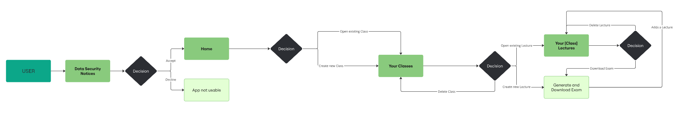

🌍 **Sprache / Language**:  
🇩🇪 [Deutsch](#deutsche-version) | 🇬🇧 [English](#english-version)

---

## 📖 Deutsche Version <a id="deutsche-version"></a>

### I. Projektbeschreibung

Im Wintersemester 2024/2025 haben wir eine Python / Streamlit-App entwickelt, die Lehrenden und Studierenden das KI-gestützte Generieren von Klausuren erleichtert. Nutzer:innen können _Classes_ und zugehörige _Lectures_ anlegen, wobei unser System mithilfe von RAG (Retrieval-Augmented Generation) die Inhalte aus Vorlesungsfolien (PDFs) analysiert und passende Prüfungsfragen generiert. Diese Lösung optimiert die Klausurerstellung, spart wertvolle Zeit und sorgt für eine zielgerichtete, inhaltsbasierte Prüfungsvorbereitung.

### II. Architektur



### III. Benutzeranleitung

#### 1. Repository klonen

```bash
  git clone https://github.com/mikamartinb/xp-chat.git
  cd xp-chat
```

#### 2. Virtuelle Umgebung erstellen und aktivieren

```bash
  python3.10 -m venv venv
```

- Aktivieren (Windows)

```bash
  venv\Scripts\activate
```

- Aktivieren (Mac/Linux)

```bash
  source venv/bin/activate
```

#### 3. Abhängigkeiten installieren

```bash
  pip install -r requirements.txt
```

#### 4. API-Schlüssel hinzufügen (LLM)

- Erstelle ein Datei _`key.secret`_ und füge folgenden Schlüssel ein

```bash
  [GDWG]
  API_KEY = "DEIN_SCHLÜSSEL"
```

#### 5. App starten

```bash
  streamlit run app.py
```

##

_Wir wünschen euch viel Spaß mit dem Exam-Generator!_

_~Fergan, Jonne & Mika_

---

## 📖 English Version <a id="english-version"></a>

### I. Project Discription

In the winter semester 2024/2025, we developed a Python / Streamlit app that makes it easier for teachers and students to generate AI-supported exams. Users can create _Classes_ and associated _Lectures_, whereby our system uses RAG (Retrieval-Augmented Generation) to analyze the content from lecture slides (PDFs) and generate suitable exam questions. This solution optimizes exam creation, saves valuable time and ensures targeted, content-based exam preparation.

### II. Architecture


### III. User Guide

#### 1. Clone repository

```bash
  git clone https://github.com/mikamartinb/xp-chat.git
  cd xp-chat
```

#### 2. Create and activate a virtual environment

```bash
  python3.10 -m venv venv
```

- Activate (Windows)

```bash
  venv\Scripts\activate
```

- Activate (Mac/Linux)

```bash
  source venv/bin/activate
```

#### 3. Install dependencies

```bash
  pip install -r requirements.txt
```

#### 4. Add API-key (LLM)

- Create a file _`key.secret`_ and add a LLM API-key

```bash
  [GDWG]
  API_KEY = "YOUR_KEY"
```

#### 5. Start app

```bash
  streamlit run app.py
```

##

_We hope you enjoy using the Exam Generator!_

_~Fergan, Jonne & Mika_
